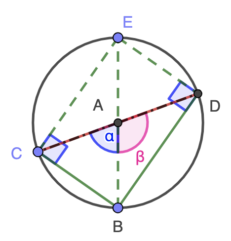
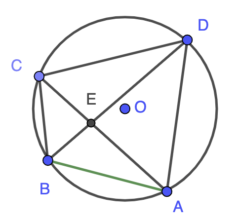
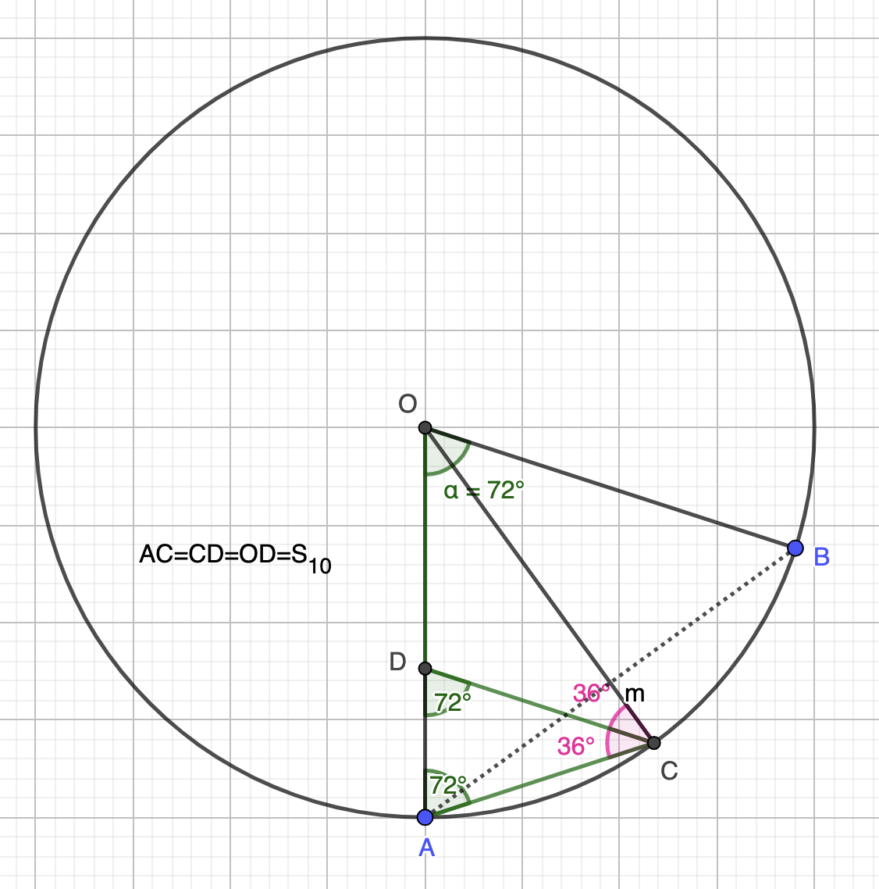

1: 托勒密弦表(Ptolemy Chords table)
====================================================

1.1 内容提要
----------------------------------------------------
中学的青少年朋友常常抱怨三角函数太难，我认为主要是教材普遍脱离实际，过分追求理论的系统性，
掩盖了真理发现的过程，从而在一定程度上失去了趣味性。
让我们穿越回古希腊时代，以初中几何(欧几里得几何原本的知识)为基础，沿着托勒密的足迹逐步计算出弦表，

我们从单位圆内接正n边形及勾股定理为出发点，在这个过程中我们会自然而然的“发现“托勒密定理，
并以此为根基推导出高中教材中所有的三角函数公式。

1.2 托勒密(Ptolemy)
----------------------------------------------------
托勒密是古希腊天文学家、数学家，他完善和巩固了地球中心学说，他建立的弦表供后人使用了千年之久。
托勒密将古希腊文明推向了巅峰，托勒密之后，欧洲文明可以说是后继无人，从此陷入漫长，黑暗的中世纪，
这一沉睡长达千年之久，直到文艺复兴。
托勒密的巨著Almagest中记录了一组弦表，与我们今天用的的正弦表略有区别。这本巨著曾经是天文数理的经典教材，书名Almagest
是阿拉伯文翻译，据说字面意思有最伟大的书的意思，足见其影响力。

我在上中学的时候，历史上学到托勒密和他的地球中心说时，是一种略带“鄙视”的心态，
因为现在我们在知道地球并不是太阳系的中心，当时天真的我只是简单的认为他弄出一个错误的理论，而且还误导了人类上千年。
真可谓是无知者无畏。后来随着阅读量以及自身知识的提升，才意识到自己年少无知。

受限于当时的观测水平和精度，人类曾一度认为地球是宇宙的中心，并以此建立了历法，对农业文明来说，历法的重要性是不言而喻，
试想一下一个国家或部落因为算不清楚春夏秋冬，而错过了播种的季节会是什么样的后果？
然而当人们观测到行星逆行现象后，当时的理论无法解释这一现象，整个学术界陷入怀疑甚至慌乱，这可以说是一次重大危机，
在黑暗的宇宙中，地球文明这艘大船可能会暂时的停下来，或是迷失方向而暂时的偏离航向，
托勒密体系从数学上解释了当时观测到的各种现象，从而化解了这次危机。

1.3 弦表(Chords table)
----------------------------------------------------
托勒密弦表等价于在一个单位圆中，求给定圆心角对应的弦长，如 :numref:`fig-chord-def` 所示：

   crd 定义

.. math::

   AB = 2 \cdot  AD = 2 \cdot  sin \frac{ \beta }{2}

公式 :eq:`eq-crd-def` 确定了 :math:`crd(\beta)` 函数和 :math:`sin(\beta)`  函数的关系。

.. math::
   :label: eq-crd-def 

   crd (\beta) = 2 sin (\frac{ \beta }{2})

托勒密弦表范围为 :math:`0^\circ` 到 :math:`180^\circ` ，以 :math:`0.5^\circ` 度为增量，如 :numref:`fig-chord-def-gif` 所示：

   crd 动画

.. table:: Ptolemy Chord Table
   :name: tb-chord-1 

   +---------+-----+--------+----+-----+-----+-----+
   | 圆心角  | 0   |  0.5   | 1  | 1.5 | ... | 180 |
   +=========+=====+========+====+=====+=====+=====+
   | 弦长    | 0   | 0      | .. | ..  | ..  |  2  |
   +---------+-----+--------+----+-----+-----+-----+

1.4 从勾股定理出发
----------------------------------------------------
勾股定理 :math:`a^2 + b^2 = c^2`.

通过最简单的几何知识，我们知道圆内接正六边形的边长等于半径，即： :math:`crd(60^\circ) = 1` ，
则圆的周长是6，因此圆周率大约是3。如 :numref:`fig-hexagon` 所示：

   圆内接正六边形

圆心 :math:`\angle` EAF等于60 :math:`^\circ` :math:`\triangle` EAF 为等边三角形。

1. 做 :math:`\angle` EAF的角平分线AU(`几何原本Book 1 Proposition 9 <https://mathcs.clarku.edu/~djoyce/elements/bookI/propI9.html>`_)，

2. :math:`\triangle AEV \cong \triangle AFV` (SAS (`几何原本Book 1 Proposition 4 <https://mathcs.clarku.edu/~djoyce/elements/bookI/propI4.html>`_))

3. 由垂径定理可得：AU :math:`\bot` EF(`几何原本Book 3 Proposition 3 <https://mathcs.clarku.edu/~djoyce/elements/bookIII/propIII3.html>`_)

现在可以利用勾股定理计算EU的长度，注意圆半径为1。

.. math::
   \left\{
   \begin{aligned}
   AV^2 = 1^2 - (\frac{EF}{2})^2 \\
   EU^2 = (\frac{EF}{2})^2 + UV^2 \\
   UV = 1 - AV
   \end{aligned}
   \right.

以EF为已知量，EU为未知量，整理方程组：

.. math::

   EU^2 = (\frac{EF}{2})^2 + (1-AV)^2 = (\frac{EF}{2})^2 + 1 + AV^2 - 2AV \Rightarrow 

   EU^2 = (\frac{EF}{2})^2 + (1-AV)^2 = (\frac{EF}{2})^2 + 1 + 1 - (\frac{EF}{2})^2 - 2AV \Rightarrow 

   EU^2 = 2 - 2AV = 2 - 2 \sqrt{1-(\frac{EF}{2})^2}

整理得到：

.. math::
   :label: eq-n-2n

   EU^2 = 2 - 2AV = 2 - \sqrt{4-EF^2}

其中EF为圆内接正6边形边长，EU为圆内接正12边形边长。通过公式 :eq:`eq-n-2n` 
我可从 :math:`crd(60^\circ)` 计算出 :math:`crd(30^\circ)` 。
如果继续尝试从圆内接正12边形边长出发，计算24边形边长，会发现最终得到同样的一个公式。

公式 :eq:`eq-n-2n` 告诉我们，可以直接从 :math:`crd(\theta)` 
直接计算出 :math:`crd(\frac{\theta}{2})` ，从而避免解勾股定理的联立方程组，这也是三角函数的优势之一。

利用公式 :eq:`eq-n-2n` ，我们可以不断的扩大n，n越大，则圆内接正n边形的周长（和面积）越接近圆的周长（和面积）。
这就是中国古代数学家刘徽创立的割圆术，后来祖冲之在刘徽割圆术的基础上，计算出相当于内接12288边形的边长，
从而得出圆周率 :math:`3.1415926 < \pi < 3.1415927`，用圆外切正n边形确定上界。这是当时世界上精度最高的圆周率，这一记录同样保持了千年之久。
要知道在古代，并没有现在的阿拉伯数字，也没有这么简便快捷的运算法则。不信你试试计算：
三万一千零四十三点五三 乘以 两千一百二十一，注意：不能转换为阿拉伯数字，然后用我们现代运算法则来计算。
或者试试计算：MMXVII * MMXV.

所以在古代文明中，圆周率的精度标志着了一个文明的发展程度。
有了更加精准圆周率作为工具，祖冲之提出的大明历成为了当时世界上最为精准的历法。

1.5 半角公式与二倍角公式
----------------------------------------------------
公式 :eq:`eq-n-2n` 说明了圆内接正 :math:`n` 边形边长和圆内接正 :math:`2n` 边形边长之间的关系，
不妨设 
:math:`S_n`
为内接正n边形边长，:math:`S_{2n}` 为内接正2n变形边长。

.. math::
   :label: eq-s2n

   S_{2n}^2 = 2 - \sqrt{4-{S_n}^2}

这个公式等价于：

.. math::
   :label: eq-crd-half

   crd^2 (\frac{\theta}{2}) = 2 - \sqrt{4-crd^2 \theta}

现在可以快速的验证一下我们计算的正确性，我们知道单位圆内接正四边形边长为 :math:`\sqrt{2}` ，如 :numref:`fig-chord-squre` 所示：

   内接正四边形边长

单位圆直径为2，即 :math:`crd(180^\circ)=2` ，利用半角公式 :eq:`eq-crd-half` 可得：

.. math::

   crd^2 {90^\circ} = 2 - \sqrt{4-crd^2 180^\circ} = 2

即：

.. math::

   crd {90^\circ} = \sqrt{2}

与我们直接利用勾股定理计算结果一致。

反过来，也可以从 :math:`S_{2n}` 边形边长计算出 :math:`S_n` 变形边长。
把公式 :eq:`eq-s2n` 中的 :math:`S_{2n}` 当已知量，解出  :math:`S_n` 即可：

.. math::
   S_{2n}^2 = 2 - \sqrt{4-{S_n}^2} \Rightarrow 
   
   2 - {S_{2n}}^2  = \sqrt{4-{S_n}^2} \Rightarrow 

   4 + {S_{2n}}^4 - 4 {S_{2n}}^2 = 4 - {S_n}^2

解得：

.. math::
   :label: eq-s2n-n

   {S_n}^2 = {S_{2n}}^2 \cdot (4 - {S_{2n}}^2)

写成crd二倍角公式为：

.. math::
   :label: eq-double

   crd^2 2 \theta  = crd^2 \theta \cdot (4 - crd^2 \theta)

我们已经知道 :math:`crd(60^\circ) = 1` ，可以利用公式 :eq:`eq-double` 计算 :math:`crd(120^\circ)` 来验证crd二倍角公式：

.. math::

   crd^2 120^\circ = (crd^2 60^\circ) \cdot (4 - crd^2 60^\circ) = 3

依然和直接利用勾股定理计算单位圆内接正三边形结果一致，这里略去计算步骤，
一个简单验证方法是 :math:`crd(120^\circ) = 2 \cdot sin(60^\circ) = \sqrt{3}` ，这和利用crd二倍角公式计算结果一致。

   
现在我们利用半角公式和二倍角公式可以制得弦表如下：

.. csv-table:: crd table
   :name: tb-chord-2
   :header: "圆心角", "弦长", "圆心角", "弦长", "圆心角", "弦长", "圆心角", "弦长" 
   :align: center

   0.0, 0.0, 7.5, 0.130806, 15.0, 0.261052, 22.5, 0.390181,
   30.0, 0.517638, 45.0, 0.765367, 60.0, 1.0, 90.0, 1.414214,
   120.0, 1.732051, 180.0, 2.0,

1.6 托勒密定理猜想
----------------------------------------------------
通过半角公式或者倍角公式，我们能够根据已知两条弦长，计算出第三条弦长，进一步能否一般化呢？
如 :numref:`fig-ptolemy-guess1` 所示：

   合角弦长

能否已知 :math:`crd(\alpha)` :math:`crd(\beta)` 且
:math:`\angle \alpha \neq \angle \beta` 求出 :math:`crd(\alpha+\beta)` 即CD的长度呢？

我们需要尽可能多的挖掘已知量，并把它和目标未知量联系起来，于是我们想到以下关系：

1. 过B点做直径BE，因为直径为2，得到一个已知量。

2. 连接CE和DE，得到：  :math:`CE \bot CB`  且 :math:`DE \bot BD` 。
直径所对的圆周角是直角(`几何原本Book 3 Proposition 31 <https://mathcs.clarku.edu/~djoyce/elements/bookIII/propIII31.html>`_)
利用勾股定理：

.. math::
   \left\{
   \begin{aligned}
   CE=\sqrt{2^2 - CB^2} = crd(180^\circ - \alpha) \\
   DE=\sqrt{2^2 - BD^2} = crd(180^\circ - \beta)
   \end{aligned}
   \right.

这其实是crd函数的补角公式：

.. math::
   :label: eq-supplement

   crd(180^\circ - \theta) = \sqrt{2^2 - crd(\theta)}

现在四边形BCED中，四条边为已知量，其中一条对角线是直径，也是已知量，能否求出另外一条对角线：CD，即：:math:`crd(\alpha + \beta)`

现在问题转化为：寻找四边形对角线和四条边的关系，我们先来考察特殊情况：

   勾股定理是托勒密定理的特殊形式

当四边形为矩形时，设边长分别为：a, b，对角线长度为：c，由勾股定理得：:math:`a^2 + b^2 = c^2` 
但是这并不能直观反应四条边长和对角线的关系，尝试改写为：:math:`a \cdot a + b \cdot b = c \cdot c` ， 
于是猜测：对边乘积之和等于对角线乘积。这便是托勒密定理，在圆内接四边形中，设四条边长依次为a,b,c,d，对角线长度为e,f，则有：

.. math::
   a \cdot b + c \cdot d = e \cdot f

现在利用已经计算出来的结果来验证这个猜想：

   利用已知crd函数验证托勒密定理

.. math::
   \left\{
   \begin{aligned}
   crd(30^\circ) = \sqrt{2-\sqrt 3} \\
   crd(60^\circ) = 1 \\
   crd(120^\circ) = \sqrt 3 \\
   crd(90^\circ) = \sqrt 2 \\
   \end{aligned}
   \right.

由补角公式 :eq:`eq-supplement` 得：

.. math::
   crd(150^\circ) = \sqrt{2^2 - crd(30^\circ)} = \sqrt{2+\sqrt 3}

根据猜想：

.. math::
   crd(60^\circ) \cdot crd(150^\circ) + crd(120^\circ) \cdot crd(30^\circ) = crd(180^\circ) \cdot crd(90^\circ)

于是：

.. math::
   \sqrt{2+\sqrt{3}} \cdot 1 + \sqrt{2-\sqrt 3} \cdot \sqrt{3} = 2 \cdot \sqrt{2}

在根式化简过程中如果遇到共轭根式和或差，常用的一个技巧是：先算平方，化简后再开方。现在两边同时平方，得：

.. math::
   2+\sqrt{3} + 3 \cdot (2-\sqrt{3}) + 2 \cdot \sqrt{2+\sqrt{3}} \cdot \sqrt{3} \cdot \sqrt{2-\sqrt{3}} = 8  \Rightarrow  \\
   2 + \sqrt{3} + 6 - 3 \cdot \sqrt{3} + 2 \cdot \sqrt{3} = 8 \Rightarrow 
   8 = 8

现在我们进一步验证了这个猜想。那么对圆内任意四边形，托勒密定理由该如何证明呢？你能试试吗？

1.7 古希腊几何四则运算
----------------------------------------------------
古希腊几何上的量并不用具体的数字表示，例如我们现在讲的5cm，8km这样。
对任意给定线段进行加减乘除是按照尺规作图的方式进行的：

1. 加法和减法，把两条线段一端固定在一起作为圆心，用其中一条线段为半径，画一个圆，总长度为和，在相反方向得到差。
另外线段乘以整数倍，也是通过不断的画圆，通过叠加得到总线段，如： :numref:`fig-segment-add`

   线段加减

2. 线段乘除，有时按照面积进行，例如线段 :math:`A \cdot B` 则做一个以A长，B为宽做矩形，除法把面积转化为线段。
但是有时候被比较的对象不一定是面积，比如把两条线段相乘再和另外的线段比较。这种情况下则利用相似图形对应边成比例来进行。
例如: 在 :numref:`fig-segment-mul` 中求 :math:`EF \cdot EH`

   线段乘除

在EF上任取一点I，连接HI，然后做  :math:`FK \parallel HI`，则：:math:`\triangle EIH \sim \triangle EFK` 有：

.. math::
   \frac{EH}{EK} = \frac{EI}{EF}

以EI为单位线段，相当于我们现在的长度单位，EK为EF和EH的乘积。

.. math::
   EF*EH = EK

除法是乘法的反向操作，即这个例子中，如果EK是已知量，EF为未知量，则 :math:`\frac{EK}{EH} = EF`

总之线段乘除关键是构造相似三角形，或者构造面积。现在你能证明托勒密定理了吗？

1.8 托勒密定理证明
----------------------------------------------------
现在我们要通过相似三角形来做线段乘法，有两个角相等的三角形相似，
因为内角和为 :math:`180^\circ` 只要有两个角相等，第三个角就相等了。
现在来考察圆内接四边形中，所有的三角形:

   圆内任意内接四边形

1. :math:`\triangle CED \sim \triangle BEA` , 
同一条弦对的圆周角相等(`几何原本Book 3 Proposition 21 <https://mathcs.clarku.edu/~djoyce/elements/bookIII/propIII21.html>`_))。
于是：

.. math::
   \frac{CD}{BA} = \frac{CE}{BE} = \frac{ED}{EA}

这一组相似三角形得到的是对边相除，:math:`\frac{CD}{AB}` ，我们并不关心。
同理， :math:`\triangle CEB \sim \triangle DEA` 也不是我们关心的。

2. 剩下的组合中，任选两个三角形，他们至少有一条公共边。如 :numref:`fig-quadrilateral1` 所示：
图中 AB是 :math:`\triangle ABC` 和 :math:`\triangle ABD` 的公共边。且 :math:`\angle BCA = \angle BDA`
同一条弦对的圆周角相等(`几何原本Book 3 Proposition 21 <https://mathcs.clarku.edu/~djoyce/elements/bookIII/propIII21.html>`_))。
现在分两种情况讨论：

 2.1 如果还有另外一组角相等，假设: :math:`\angle CBA = \angle BAD` 即三个角都相等。因为他们存在公共边，
 利用ASA(`几何原本Book 1 Proposition 26 <https://mathcs.clarku.edu/~djoyce/elements/bookI/propI26.html>`_))，
 则：:math:`\triangle ABC \simeq \triangle ABD`，得到一组对边相等，即BC = AD。

 2.2 再利用圆内接四边形对角互补性质(`几何原本Book 3 Proposition 22 <https://mathcs.clarku.edu/~djoyce/elements/bookIII/propIII22.html>`_))
 可以得到 :math:`\triangle BCD \simeq \triangle BAD` (ASA)，则另外一组对边相等，即CD = AB。

 2.3 现在四边形有两组对边分别相等，则四边形至少是一个平行四边形。

 2.4 再利用圆内接四边形对角互补性质(`几何原本Book 3 Proposition 22 <https://mathcs.clarku.edu/~djoyce/elements/bookIII/propIII22.html>`_))
 进一步推导出ABCD是个矩形。因为平行四边形对角相等，而圆内接四边形对角互补，即：:math:`\alpha + \alpha = 180^\circ`，则 :math:`\angle \alpha = 90^\circ` 

 而矩形我们可以直接由勾股定理得出托勒密定理。

现在我们来考虑任选两个有一条公共边的三角形，例如：:math:`\angle BCD > \angle BAD` 做 :math:`\angle BCA = \angle FCD` 
(`几何原本Book 1 Proposition 23 <https://mathcs.clarku.edu/~djoyce/elements/bookI/propI23.html>`_))
交对角线BD与F，由三角形大脚对大边性质(`几何原本Book 1 Proposition 19 <https://mathcs.clarku.edu/~djoyce/elements/bookI/propI19.html>`_))，
交点一定在BD以内，不会跑到圆外面去。

于是有：:math:`\triangle CBA \sim \triangle CFD` 由相似三角形性质有：:math:`\frac{AB}{DF} = \frac{AC}{CD}` 
顺利的计算出了对边乘积：:math:`AB \cdot CD = AC \cdot DF`。

.. figure :: ./images/ptolemy_prove1.png
   :align: center
   :width: 200
   :name: fig-ptolemy-prove-sim1

   托勒密定理证明1

同理： :math:`\triangle CBF \sim \triangle CAD`， :math:`\frac{BC}{AC} = \frac{BF}{AD}`，于是得到另外一组对边乘积： :math:`BC \cdot AD = AC \cdot BF`

   托勒密定理证明2

.. math::
   \left\{
   \begin{aligned}
    AB \cdot CD = AC \cdot DF \\
    BC \cdot AD = AC \cdot BF \\
    DF+BF = BD \\ 
   \end{aligned}
   \right.

所以：

.. math::
   :label: eq-ptolemy

   AB \cdot CD + BC \cdot AD = AC \cdot (DF+BF) = AC \cdot BD

1.8 和角公式与差角公式
----------------------------------------------------
现在根据托勒密定理，可以得到和角公式与差角公式，需要强调的是，托勒密定理对圆内接四边形普遍成立，
但是在计算弦长时，我们总是通过直径做一条辅助线，这样可以利用直径为2，并且直径所对圆周角是直角，可以使用勾股定理求补角的弦长。

   合角公式推导

由托勒密定理：

.. math::
   2 \cdot crd(\alpha + \beta) = crd(\alpha) \cdot crd(180^\circ - \beta) + crd(\beta) \cdot crd(180^\circ - \alpha)

勾股定理得补角公式：

.. math::
   crd(180^\circ - \alpha) = \sqrt{2^2 - crd^2(\alpha)}

   crd(180^\circ - \beta) = \sqrt{2^2 - crd^2(\beta)}

得合角公式：

.. math::
   :label: eq-sum

   crd(\alpha+\beta) = \frac{ crd(\alpha) \cdot crd(180^\circ - \beta) + crd(\beta) \cdot crd(180^\circ - \alpha)}{2}

由于 :math:`crd(180^\circ) = 2` 现在利用我已有的弦表快速验证：

.. math::
   crd(120^\circ + 60^\circ) = \frac{crd(120^\circ) \cdot crd(180^\circ - 60^\circ) + crd(60^\circ) \cdot crd(180^\circ - 120^\circ)}{2}

   crd(180^\circ) = \frac{ \sqrt{3} \cdot \sqrt{3} + 1 \cdot 1}{2} = 2

为了更加方便的计算 :math:`crd(\alpha-\beta)`  ,我们对辅助线略作修改：

   差角公式推导

.. math::
   :label: eq-sub

   crd(\alpha - \beta) = \frac{ crd(\alpha) \cdot crd(180^\circ-\beta) - crd(\beta) \cdot crd(180^\circ-\alpha)} {2}

再次利用我已有的弦表快速验证：

.. math::
   crd(120^\circ - 60^\circ) = \frac{ crd(120^\circ) \cdot crd(180^\circ - 60^\circ) - crd(60^\circ) \cdot crd(180^\circ - 120^\circ)}{2}

   crd(60^\circ) = \frac{ \sqrt{3} \cdot \sqrt{3} - 1 \cdot 1}{2} = \frac{3-1}{2} = 1

现在我们可以更新弦表：

.. csv-table:: crd table
   :header: "圆心角", "弦长", "圆心角", "弦长", "圆心角", "弦长", "圆心角", "弦长" 
   :align: center

   0.0, 0.0, 7.5, 0.130806, 15.0, 0.261052, 22.5, 0.390181,
   30.0, 0.517638, 37.5, 0.642879, 45.0, 0.765367, 52.5, 0.884577,
   60.0, 1.0, 67.5, 1.11114, 75.0, 1.217523, 82.5, 1.318692,
   90.0, 1.414214, 97.5, 1.50368, 105.0, 1.586707, 112.5, 1.662939,
   120.0, 1.732051, 127.5, 1.793745, 135.0, 1.847759, 142.5, 1.89386,
   150.0, 1.931852, 157.5, 1.961571, 165.0, 1.98289, 172.5, 1.995718,
   180.0, 2.0,

1.9 3倍角公式
----------------------------------------------------
现在依然只能得到有限的弦表，现在我们试试推导出3倍角公式：

由和角公式  :eq:`eq-sum` 

.. math::
   crd(2\theta + \theta) = \frac{crd(2\theta) \cdot crd(180^\circ - \theta) + 
   crd(\theta) \cdot crd(180^\circ - 2\theta)}{2}

第一项由二倍角公式 :eq:`eq-double` 有：

.. math::

   crd(2\theta) \cdot crd(180^\circ - \theta) = crd(\theta) \cdot crd(180^\circ - \theta)

对于第二项，先利用差角公式 :eq:`eq-sub` 计算 :math:`crd(180^\circ - 2\theta)`

.. math::

   crd((180^\circ - \theta)-\theta) = \frac{crd(180^\circ - \theta) \cdot crd(180^\circ - \theta) - crd(\theta) \cdot crd(\theta)}{2}

整理并化简得到3倍角公式 :eq:`eq-triple`

.. math::
   :label: eq-triple

   crd(3\theta) = 3 \cdot crd(\theta) - crd^3(\theta)

利用已知crd函数快速验证3倍角公式 :eq:`eq-triple`

.. math::

   crd(3 \cdot 30^\circ) = 3 \cdot crd(30^\circ) - crd^3(30^\circ)  \Rightarrow \\
   \sqrt{2} = crd(30^\circ) \cdot (3 - crd^2(30^\circ)) \Rightarrow \\
   \sqrt{2} = \sqrt{2-\sqrt{3}} \cdot (1+\sqrt{3})

两边同时平方：

.. math::
   2 = (2-\sqrt{3}) \cdot (1^2 + 2\sqrt{3} + 3) \Rightarrow \\
   2 = 8 + 4\sqrt{3} - 4\sqrt{3} - 6

等式成立。

1.10 1/3 角公式
----------------------------------------------------
如果把3倍角公式 :eq:`eq-triple` 中 :math:`crd(3\cdot \theta)` 当作已知道量，
:math:`crd(3\cdot \theta)` 当作未知量，则得到1/3 角公式：

.. math::
   :label: eq-one-third

   crd^3(\theta) - 3 \cdot crd(\theta) + crd(3\theta)  = 0

这是一个典型的形如：:math: `x^3 + px + q = 0` 的3次方程。

1.11 圆内接正五边形
----------------------------------------------------
现在依然只能得到有限的弦表，通过尺规作图计算圆内接正三边形边长可以得到 :math:`crd(120^\circ)` ，
正四边形边长可以得到 :math:`crd(90^\circ)` ，于是自然想到进一步计算圆内接正五边形边长，其圆心角为 :math:`72^\circ` 。

   正五边形与正十边形

在图 :numref:`fig-pentagon` 中，:math:`AB=crd(72^\circ)` , 作 :math:`\angle AOB` 的角平分线OC，
则： :math:`AC=crd(36^\circ)` ，以C为圆心，AC为半径画圆，交OA于点D，由等腰三角形性质得：
:math:`AC=CD=OD=S_{10}` 。 :math:`\triangle AOC \sim \triangle ACD` 于是：
:math:`\frac{S_{10}}{1} = \frac{1-S_{10}}{S_{10}}`
这是一个二次方程：

.. math::
  :label: eq-pentagon

  S^2_{10} + S_{10} - 1 = 0

由二次方程求根公式得：:math:`S_{10} = \frac{-1 \pm \sqrt{5}}{2}`
舍去负根，得到 :math:`S_{10} = \frac{\sqrt{5}-1}{2}` 
由倍角公式 :eq:`eq-double` 可计算出正5边形边长。

内接正五边形尺规作图也是初中的难点，能通过几何方法计算出边长，
就找到了尺规作图的方法，你能试试吗？

.. math::

  crd^2({72^\circ}) = crd^2(32^\circ) \cdot (4 - crd^2(32^\circ))

解得：

.. math::

  crd({72^\circ}) = \frac{10 - 2\sqrt{5}}{2}

现在更新弦表：

.. csv-table:: crd table
   :header: "圆心角", "弦长", "圆心角", "弦长", "圆心角", "弦长", "圆心角", "弦长" 
   :align: center

   0.0, 0.0, 1.5, 0.026179, 3.0, 0.052354, 4.5, 0.07852,
   6.0, 0.104672, 7.5, 0.130806, 9.0, 0.156918, 10.5, 0.183003,
   12.0, 0.209057, 13.5, 0.235075, 15.0, 0.261052, 16.5, 0.286985,
   18.0, 0.312869, 19.5, 0.338699, 21.0, 0.364471, 22.5, 0.390181,
   24.0, 0.415823, 25.5, 0.441395, 27.0, 0.466891, 28.5, 0.492307,
   30.0, 0.517638, 31.5, 0.542881, 33.0, 0.568031, 34.5, 0.593083,
   36.0, 0.618034, 37.5, 0.642879, 39.0, 0.667614, 40.5, 0.692234,
   42.0, 0.716736, 43.5, 0.741115, 45.0, 0.765367, 46.5, 0.789488,
   48.0, 0.813473, 49.5, 0.837319, 51.0, 0.861022, 52.5, 0.884577,
   54.0, 0.907981, 55.5, 0.931229, 57.0, 0.954318, 58.5, 0.977242,
   60.0, 1.0, 61.5, 1.022586, 63.0, 1.044997, 64.5, 1.067229,
   66.0, 1.089278, 67.5, 1.11114, 69.0, 1.132812, 70.5, 1.15429,
   72.0, 1.175571, 73.5, 1.196649, 75.0, 1.217523, 76.5, 1.238188,
   78.0, 1.258641, 79.5, 1.278878, 81.0, 1.298896, 82.5, 1.318692,
   84.0, 1.338261, 85.5, 1.357601, 87.0, 1.376709, 88.5, 1.395581,
   90.0, 1.414214, 91.5, 1.432604, 93.0, 1.450749, 94.5, 1.468645,
   96.0, 1.48629, 97.5, 1.50368, 99.0, 1.520812, 100.5, 1.537684,
   102.0, 1.554292, 103.5, 1.570634, 105.0, 1.586707, 106.5, 1.602508,
   108.0, 1.618034, 109.5, 1.633283, 111.0, 1.648252, 112.5, 1.662939,
   114.0, 1.677341, 115.5, 1.691456, 117.0, 1.70528, 118.5, 1.718813,
   120.0, 1.732051, 121.5, 1.744992, 123.0, 1.757634, 124.5, 1.769975,
   126.0, 1.782013, 127.5, 1.793745, 129.0, 1.805171, 130.5, 1.816286,
   132.0, 1.827091, 133.5, 1.837582, 135.0, 1.847759, 136.5, 1.857619,
   138.0, 1.867161, 139.5, 1.876383, 141.0, 1.885283, 142.5, 1.89386,
   144.0, 1.902113, 145.5, 1.91004, 147.0, 1.917639, 148.5, 1.92491,
   150.0, 1.931852, 151.5, 1.938462, 153.0, 1.94474, 154.5, 1.950685,
   156.0, 1.956295, 157.5, 1.961571, 159.0, 1.96651, 160.5, 1.971112,
   162.0, 1.975377, 163.5, 1.979303, 165.0, 1.98289, 166.5, 1.986137,
   168.0, 1.989044, 169.5, 1.99161, 171.0, 1.993835, 172.5, 1.995718,
   174.0, 1.997259, 175.5, 1.998458, 177.0, 1.999315, 178.5, 1.999829,
   180.0, 2.0,

1.12 crd(0.5)近似求解
----------------------------------------------------
现在可以得到间隔为 :math:`1.5^\circ` 的弦表，要计算出 :math:`crd(1^\circ)` 或者
:math:`crd(0.5^\circ)` ，最简单的办法是利用 :math:`crd(1.5^\circ)` 及1/3角公式  :eq:`eq-one-third`
但是解3次方程要用到复数，超出了初中知识范围。
3次方程系统性突破是16世纪完成的，这就意味着托勒密也是通过其它手段解决这一问题的。

到此为止，我们已经用几何方法计算了圆内接3，4，5，6，边形的边长，继续下去就是正7边形，
历史上正七边形尺规作图是个千年难题，最终被证明尺规作圆内接正7边形是不能的，
这就意味着几何方法也不能精确的算出正七边形边长。

如何才能计算出 :math:`crd(0.5^\circ)` 呢？我们对 :eq:`eq-one-third` 稍做观察和变换：

.. math::
   :label: eq-one-third-1

   crd(\theta) = \frac{crd(3\theta)}{3} + \frac{crd^3(\theta)}{3}

再考察 :math:`crd(0.5^\circ)` 和 :math:`cird(1.5^\circ)` 
从几何图形和已有数据 :math:`cird(1.5^\circ) = 0.026179` ，可以发现这些数字都很小，
:math:`\frac{crd^3(\theta)}{3}` 就是一个相对的高阶小量，于是得到 :math:`crd(0.5^\circ)` 的近似值：

.. math::
   :label: eq-one-third-2

   crd(0.5^\circ) = \frac{crd(1.5^\circ)}{3}

算出了 :math:`crd(0.5^\circ)`  ，就可以用倍角公式和合角公式计算出整个托勒密弦表了。

1.12 crd函数公式与sin函数公式
----------------------------------------------------

利用半角公式 :eq:`eq-crd-half` 

.. math::

   crd^2 \frac{\theta}{2} = 2 - \sqrt{4-crd^2 \theta}

再代入 :math:`crd (\theta) = 2 sin \frac{ \theta}{2}` 可得正弦半角公式：

.. math::

   4 sin^2 \frac{\theta}{4} = 2 - \sqrt{4 - 4 sin^2 \frac{\theta}{2}} \Rightarrow 

   2 sin^2 \frac{\theta}{4} = 1 - \sqrt{1 - sin^2 \frac{\theta}{2}}

令 :math:`\alpha = \frac{\theta}{2}` 得：
   
.. math::

   sin^2 \frac{\alpha}{2} = \frac{1 - \sqrt{1 - sin^2 \alpha}}{2} \Rightarrow 

   sin^2 \frac{\alpha}{2} = \frac{1 - cos \alpha}{2} \Rightarrow 

   sin \frac{\alpha}{2} = \pm \sqrt{\frac{1 - cos \alpha}{2}}

同样我们可以利用 :math:`crd (\theta) = 2 sin \frac{ \theta}{2}` 及 :math:`crd (2 \theta) = 2 sin \theta`
可得正弦倍角公式：

.. math::

   4 sin^2 \theta = 4 sin^2 \frac{\theta}{2} (4 - 4 sin^2 \frac{\theta}{2}) \Rightarrow 

   sin^2 \theta = 4 sin^2 \frac{\theta}{2} (1 - sin^2 \frac{\theta}{2}) \Rightarrow 

   sin^2 \theta = 4 sin^2 \frac{\theta}{2} cos^2 \frac{\theta}{2} \Rightarrow 

   sin \theta = 2 sin \frac{\theta}{2} cos \frac{\theta}{2}

令 :math:`\alpha = \frac{\theta}{2}` 得：

.. math::
   sin 2 \alpha = 2 \cdot sin \alpha \cdot cos \alpha

